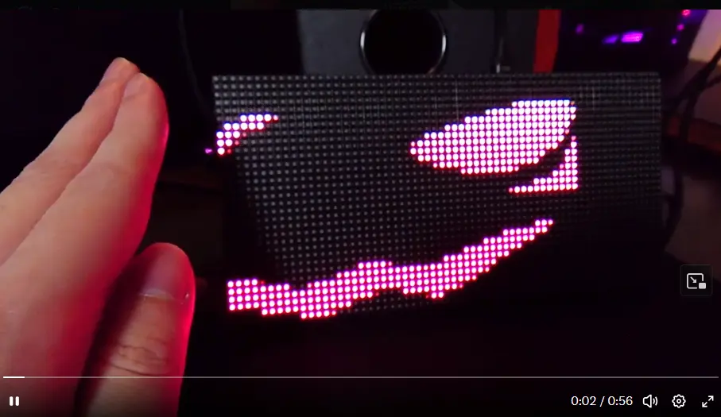
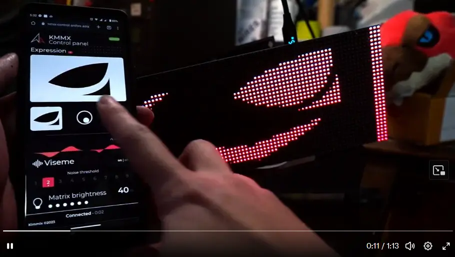
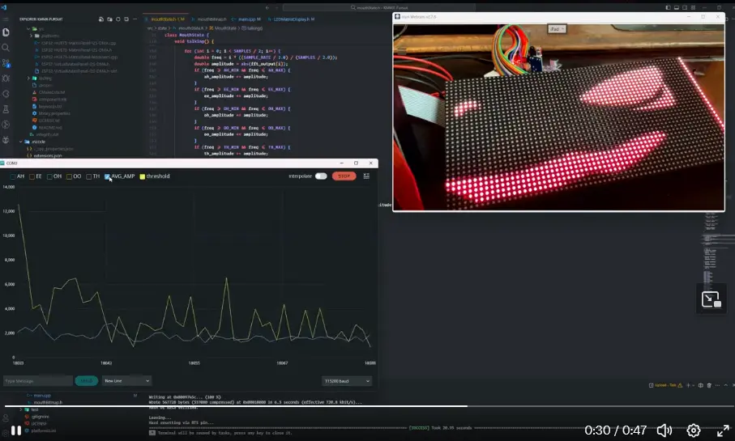

# ✨ KMMX-Fursuit Controller ✨

### Controller V2 Preview

### Controller V4 Preview

Custom PCB designed in collaboration with [Tas.Polar](https://github.com/BaiTian6641)

## 📢 Project Status

> **Note:** This is a personal project built for my own fursuit and is currently in active development. While the code is shared under the MIT License and you're welcome to use, modify, and adapt it for your own projects, please be aware that:
>
> - ⚠️ **No support is provided** at this time
> - 🔧 Features and APIs may change without notice
> - 🚧 Documentation may be incomplete or outdated
> - 🐛 Bugs and incomplete features are expected
>
> Feel free to fork, experiment, and build upon this work within the terms of the MIT License. I'm sharing this publicly in the spirit of the maker community, but I'm not able to provide assistance, answer questions, or accept contributions at this stage of development.

## 🌟 Features

- **Animated LED Matrix Displays** for eyes and mouth expressions
- **Real-time facial animations** including blinking, emoting, and mouth movements
- **Audio-reactive visemes** that respond to speech
- **Proximity sensing** for interactive "booping" responses
- **Accelerometer integration** for motion-based animations and responses
- **Bluetooth connectivity** for remote control and configuration
- **Customizable expressions** with easy bitmap conversion tools

## 🦊 Demo & Gallery

### Booping Interaction

[🎥 Watch full video on X](https://x.com/kimmix00/status/1687878110430339072/video/1)

### Bluetooth Smartphone Control

[🎥 Watch full video on X](https://x.com/kimmix00/status/1704465522497397001/video/1)

### Viseme (Audio-Reactive)

[🎥 Watch full video on X](https://x.com/kimmix00/status/1638887564550754306/video/1)

## 📋 Project Structure

Click to expand project structure

- **`src/`** - Main source code
  - **`Bitmaps/`** - Bitmap assets for eye and mouth animations
  - **`Devices/`** - Hardware driver implementations
  - **`FacialStates/`** - Facial animation state machines
  - **`KMMXController/`** - Main controller logic
  - **`Network/`** - Bluetooth connectivity
  - **`Renderer/`** - Animation and rendering code
  - **`Utils/`** - Helper functions
- **`bitmapTool/`** - Tools for converting images to bitmaps
- **`include/`** - Header files
- **`lib/`** - External libraries
- **`boards/`** - Custom board definitions

## 🚀 Getting Started

> **⚠️ Advanced Users Only:** This setup assumes familiarity with ESP32 development, PlatformIO, and embedded systems. The configuration is specific to my custom hardware, so expect to need significant modifications for your own build.

### Prerequisites

**Required:**
- [PlatformIO](https://platformio.org/) IDE or PlatformIO Core
- ESP32-S3 development board (or compatible ESP32 variant)
- Basic understanding of C/C++ and embedded development
- Soldering skills for hardware assembly

**Hardware Components:**
- HUB75 LED Matrix panels (64x32 resolution recommended)
- APDS9930 proximity sensor (optional, for booping feature)
- LIS3DH accelerometer (optional, for motion detection)
- I2S microphone module (optional, for viseme/audio reactivity)
- WS2812 LED strips (optional, for cheek/status LEDs)
- Appropriate power supply (5V, sufficient current for LED panels)

## ⚙️ Configuration

> **Note:** Configuration is currently scattered across multiple files and tailored to my specific hardware. Expect to dig through the source code to customize for your setup.

Key configuration areas you'll need to review:

- **Pin assignments** for all hardware components
- **LED matrix settings** (resolution, brightness, color correction)
- **Animation timing** parameters and frame rates
- **Sensor thresholds** (proximity, accelerometer sensitivity)
- **Bluetooth/BLE** device name and service UUIDs
- **Feature flags** to enable/disable specific hardware modules

Look for configuration in:
- Pin definitions in device-specific source files
- Main controller initialization code
- Individual device driver files in `src/Devices/`

## 🎮 Web Control Panel

Control your fursuit remotely via Bluetooth using a web browser!

  

  

    <strong>📦 <a href="https://github.com/Kimmix/KMMX-ControlPanel">Project Repository</a></strong> |
    <strong>🌐 <a href="https://kimmix-control.anthro.asia">Live Demo</a></strong>
  

  
A web-based control interface using Web Bluetooth API to wirelessly control expressions, animations, and settings from your smartphone or computer.

**Features:**
- 📱 Works on any device with Web Bluetooth support (Chrome/Edge on Android, macOS, Windows)
- 🎭 Change facial expressions on the fly
- 🎨 Adjust LED brightness and colors
- ⚙️ Configure controller settings remotely
- 🔋 No app installation required - runs directly in your browser

## ✨ Animation Creation

You can create custom animations using the included bitmap tools:

1. Design your animations as image sequences in Adobe Photoshop or After Effects
2. Export frames as individual images
3. Use the converter tool in `bitmapTool/` to convert to C++ bitmap arrays
4. Add the generated header files to your project's `src/Bitmaps/` directory
5. Register and configure the new animations in the controller code

**Note:** The bitmap tool is specific to my workflow and may require customization for your needs. Documentation for the tool is limited, so expect some trial and error.

## 📄 License

This project is licensed under the MIT License - see the LICENSE file for details.

**TL;DR:** You're free to use, modify, and distribute this code for any purpose (commercial or personal), but it comes with no warranty. This project was built for my personal use, so while you're welcome to use it, please understand it's tailored to my specific hardware setup and requirements.

## 🤝 Support & Contributing

**Current Status:** Not accepting contributions or providing support.

As this is a personal project still in active development, I'm not currently:
- ❌ Accepting pull requests or contributions
- ❌ Providing technical support or troubleshooting help
- ❌ Answering questions about setup or usage
- ❌ Maintaining issues or feature requests

**However**, you're absolutely encouraged to:
- ✅ Fork this repository and make it your own
- ✅ Learn from the code and adapt it to your needs
- ✅ Share your own creations with the community
- ✅ Use this as a starting point for your own fursuit projects

## 📱 Contact

  
Find me on Discord: kimmix

  
Or my website: <a href="https://kimmix.anthro.asia/" target="_blank">kimmix.anthro.asia/</a>

---
